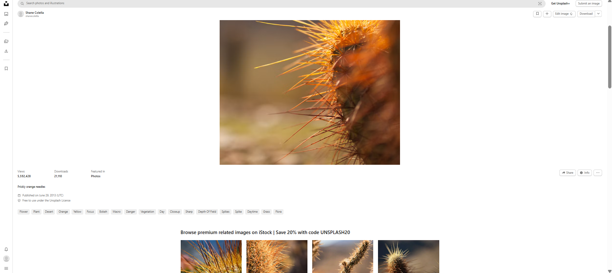

# 🖼️ React Gallery & Photo Search App

A dynamic React application that fetches images via API with pagination, detailed image info, and download capabilities.

## 🖼️ App Preview
<p align="center">
  
</p>

### 🔍 Detailed View
<p align="center">
  
</p>

## ✨ Features
- 🌐 **Dynamic API Integration:** Dynamic image fetching from API.
- 📄 **Pagination:** Smooth page switching (`Back` / `Next`).
- 🔍 **Detailed View:** Full-page layout showing creator info and image metadata.
- 📥 **Direct Image Downloads:** Single-click download option.

## 🛠️ Tech Stack
- **Frontend:** React.js, JavaScript (ES6+)
- **Build Tool:** Vite
- **Styling:** CSS3

## 🚀 Getting Started

1. **Clone the repository:**
   ```bash
   git clone [https://github.com/PriyaSingh7877/Gallery-project.git](https://github.com/PriyaSingh7877/Gallery-project.git)
